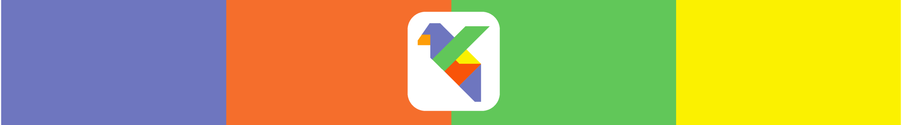
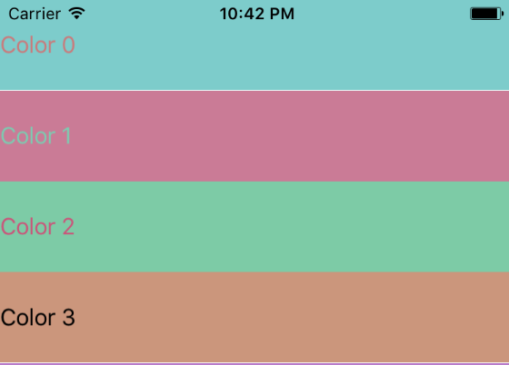
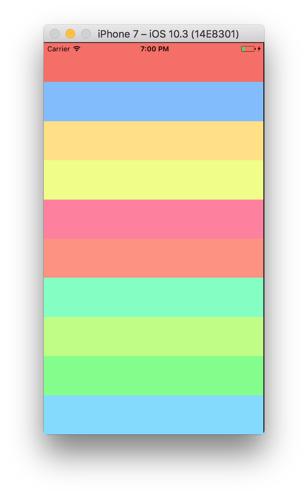

[](https://github.com/Carthage/Carthage)
[](https://cocoapods.org/pods/Lorikeet)
[](http://www.apple.com/ios/)
[](https://opensource.org/licenses/MIT)




# Lorikeet

Lightweight framework for generating visually aesthetic color-schemes in Swift

## Requirements

- UIKit

## Features
What can Lorikeet do for you

- Calculate visual color difference ([wikipedia](https://en.wikipedia.org/wiki/Color_difference))
    - Algorithms:
        - CIE76
        - CIE94
        - CIE2000
- Generate color schemes

## Installation
For Swift 4 see "Manual" install

### Carthage
In your `Cartfile` put:

```
github "valdirunars/Lorikeet"
```

### CocoaPods
In you `Podfile`

```
pod 'Lorikeet'
```

### Manual
Copy the `./Lorikeet` folder 😁🗂

## How to Use

### Basic Usage

```swift
let red: UIColor = .red

let label = UILabel()
label.backgroundColor = red

// Assign a maximum contrasting color as foreground color
label.textColor = red.lkt.complimentaryColor

// Visual color difference
let distance: Float = red.distance(to: .blue, algorithm: .cie2000)

// Generate color scheme
red.lkt.generateColorScheme(numberOfColors: 40) { colors in
    print(colors)
}
```

### Advanced

Lorikeet's `Algorithm` enum has two cases for advanced usage:
```swift
.advancedCIE94(l: Float, c: Float, h: Float, k1: Float, k2: Float)
```

```swift
.advancedCIE2000(l: Float, c: Float, h: Float)
```

Example:

```swift
let l: Float = 0.8
let c: Float = 0.9
let h: Float = 1.0

red.lkt.generateColorScheme(numberOfColors: 40,
                            using: .advancedCIE2000(l: l, c: c, h: h)) { colors in
    print(colors)
}

let range = HSVRange(hueRange: (0, 1),
         saturationRange: (0.5, 0.5),
         brightnessRange: (0.95, 0.95))

color.lkt.generateColorScheme(numberOfColors: 15,
                              withRange: range,
                              using: .cie2000) {
    colors in
}
```


### Screenshots

#### Making text readable using random colors:

```swift
let label = UILabel(frame: frame)
self.view.backgroundColor = UIColor(hue: 180/360.0,
                                    saturation: 0.5,
                                    brightness: 0.6,
                                    alpha: 1)

label.backgroundColor = self.view
    .backgroundColor!
    .lkt
    .generateRandomMatchingColor()

label.textColor = label.backgroundColor!
    .lkt
    .complimentaryColor
```



#### Generating colors:

```swift
let color: UIColor = UIColor(red: 245/255.0, green: 110/255.0, blue: 100/255.0, alpha: 1)

color.lkt.generateColorScheme(numberOfColors: 10)
```


